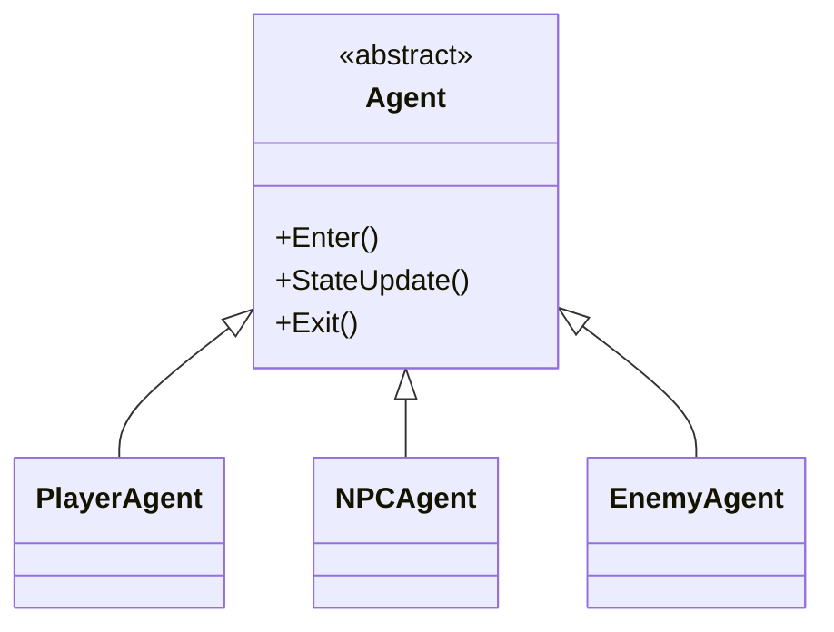
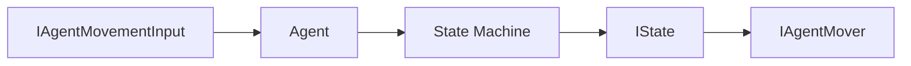
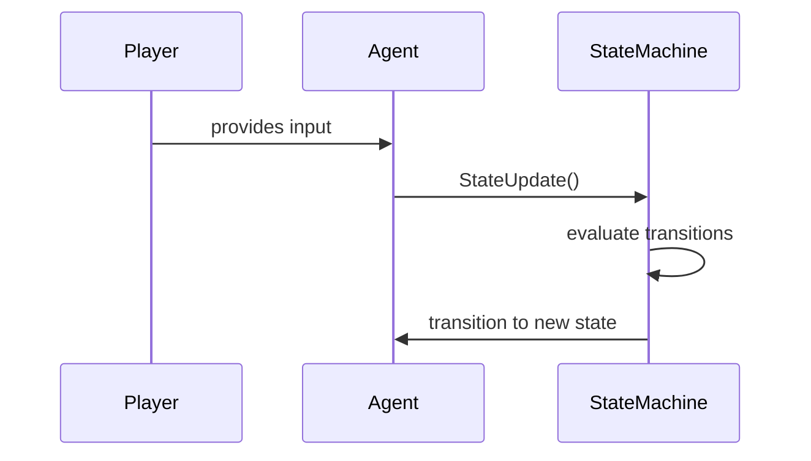

# Documentation Template

This template guides the AI assistant when generating README.md files using `/document`.

---

## Structure

```markdown
# {Feature Name}: {Specific Topic} Tutorial

Brief 1-2 sentence description of what this feature does and its primary use case.

## Overview

Explain what this is in context. Compare to alternatives or previous approaches if relevant. Keep to 2-3 sentences—just enough context for the reader to understand where this fits.

## Prerequisites

- Unity {version} or later
- Packages: {list required packages, e.g. `com.unity.inputsystem`}
- _{Any assumed knowledge, e.g. familiarity with MonoBehaviour lifecycle}_

## File Hierarchy

**Always include a file/folder tree** when documenting a module, feature, or system with more than two files.

```
Assets/GameControllers/
├── CharacterController/
│   ├── Agent.cs                  # Abstract base — coordinates state machine
│   ├── State/
│   │   ├── IState.cs
│   │   ├── IdleState.cs
│   │   └── MoveState.cs
│   ├── StateFactory/
│   │   ├── StateFactory.cs
│   │   └── PlayerStateFactory.cs
│   ├── Movement/
│   │   ├── IAgentMover.cs
│   │   └── BasicCharacterControllerMover.cs
│   └── Input Implementations/
│       ├── PlayerGameInput.cs
│       └── NPCAIInput.cs
└── CarController/
    ├── CarController.cs
    ├── CarEngine.cs              # Plain C# — intentionally not a MonoBehaviour
    └── CarStats.asset
```

> **Guideline:** Add a short comment (after `#`) on any file whose role is not obvious from its name. Include the tree whenever a new folder, subsystem, or feature is added.


## Architecture

Describe the high-level structure. **Always include at least one visual diagram** when the architecture involves multiple systems, classes, or subsystems.

Use **Mermaid diagrams** for relationships, flows, and hierarchies. Choose the diagram type that best fits the concept:

### Class / Inheritance Hierarchy



### System / Data Flow



### Sequence Diagram (for runtime flows)



> **Guideline:** Prefer diagrams over prose whenever a relationship, dependency, or flow involves three or more elements. A diagram is mandatory for any class hierarchy, state machine, or multi-step runtime process.


---

## Setup

Step-by-step instructions to get this running locally.

```bash
# example shell commands
git clone <repo-url>
cd <project>
```

1. Open in Unity Hub → select the `Project/` directory.
2. Install required packages via **Window > Package Manager**.
3. _(Any additional steps.)_

---

## {Core Concept 1}

Explanation of the first key concept with a practical code example:

```csharp
private void ExampleMethod()
{
    // Commented explanation of what this does
    SomeClass.DoThing();
}
```

## {Core Concept 2}

### {Subsection if needed}

More focused explanation with code:

```csharp
private void AnotherExample()
{
    // Show the specific pattern
}
```

### {Another Subsection}

Additional pattern or variation.

## {Core Concept N}

Continue with additional concepts as needed. Each section should be self-contained with its own code example. Aim for 2–4 core concept sections total; if a concept requires more than 3 subsections, consider a dedicated document.

## Key Takeaways

| Feature | Value |
|---------|-------|
| {Attribute 1} | {Description} |
| {Attribute 2} | {Description} |
| {Attribute 3} | {Description} |
| Best for | {Use case} |

## When to Use

- ✅ {Good use case 1}
- ✅ {Good use case 2}
- ❌ {Anti-pattern 1}
- ❌ {Anti-pattern 2}

Brief sentence recommending alternatives for the anti-patterns if applicable.

## Troubleshooting

- **{Error or symptom}:** {Cause and fix.}
- **{Error or symptom}:** {Cause and fix.}

## Learn More

- [Unity Documentation](https://docs.unity3d.com/...)
- [Unity Learn](https://learn.unity.com/...)
- _{Additional resources as needed}_
```

---

## Style Guidelines

### Tone
- Tutorial-style: teach through examples
- Assume reader is intermediate Unity developer
- Explain "why" briefly, focus on "how"
- Be concise—every sentence should add value

### Section Guidelines

| Section | Purpose | Length |
|---------|---------|--------|
| Title | Feature + specific topic | 5-8 words |
| Opening | Quick context | 1-2 sentences |
| Overview | Where this fits, alternatives | 2-3 sentences |
| Prerequisites | Requirements before starting | 2-5 bullets |
| File Hierarchy | Visual structure of files/folders | Tree with comments on non-obvious files |
| Architecture | System design with diagrams | 1+ Mermaid diagrams |
| Setup | Bare minimum to begin | 3-5 lines of code |
| Core Concepts | Teach through code | 1 paragraph + code block each; aim for 2-4 sections |
| Key Takeaways | Quick reference table | 4-6 rows |
| When to Use | Decision guidance | 2-4 pros, 2-4 cons |
| Troubleshooting | Common pitfalls and fixes | 2-5 bullets |
| Learn More | External resources | 1-3 links |

### Code Examples
- Keep examples minimal and focused (10-20 lines max)
- Include comments only for non-obvious lines
- Use realistic variable names with `m_` prefix for private fields (Unity convention; omit for non-Unity content)
- Show one concept per code block
- Prefer `private void MethodName()` pattern for Unity methods

### Formatting
- Use sentence case for headings
- Code blocks with `csharp` language hint
- Tables for comparisons and summaries
- Checkmarks (✅ ❌) for pros/cons lists; fall back to `**Do:**` / `**Avoid:**` headings if emoji rendering is uncertain
- No emojis elsewhere in the document

### What to Include
- Always: Overview, Setup, at least 2 Core Concepts, Key Takeaways
- For patterns: When to Use section
- For APIs: Code examples for each main method
- For systems: How components interact

### What to Avoid
- Long explanations without code
- Multiple concepts in one code block
- Implementation details that don't help understanding
- Repeating information from code comments
- Version history or TODO items

---

## Example Invocations

```
/document
```
Generates README using this template structure.

```
/document focus on the data binding setup
```
Emphasizes specific aspect in Core Concepts.

```
/document brief
```
Generates Overview, Setup, and Key Takeaways only.
